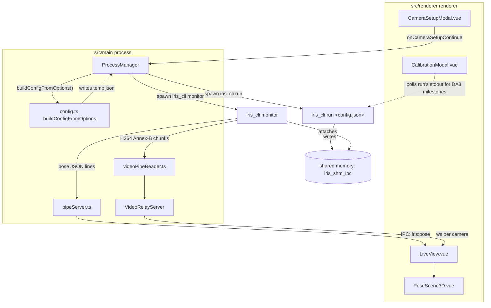

# Architecture

What each file does, how a frame gets from a camera to the live view, and
exactly what configuration reaches `iris_cli` (written while chasing a
multi-second live mocap lag on the `iris-unity-studio` fork - see the "IRIS
configuration reference" section; everything there applies here too, since
this repo's IRIS-facing code is the shared base both projects run).

## Two long-lived `iris_cli` processes, not one pipeline

The app never runs one `iris_cli` process end to end. It runs **two**,
started independently by `ProcessManager` (`src/main/iris/processManager.ts`):

- **`run`** (`iris_cli run <config.json>`) - the real pipeline: capture,
  YOLOX detection, ReID tracking, RTMPose pose estimation, DA3 triangulation
  (including startup auto-calibration), smoothing, output. Started once, at
  calibration, and stays alive through live view. This is the *only* process
  that reads the generated pipeline config.
- **`monitor`** (`iris_cli monitor --shm-name <name> --pipe <path> --video-pipe ...`)
  - a thin reader that attaches to the shared memory the `run` process is
  already writing to, and re-emits pose/video over named pipes for the UI.
  Stopping/restarting it (e.g. reopening Camera Setup) does **not** touch the
  `run` pipeline underneath.

Only `run`'s config affects capture resolution, detection/pose model
behavior, or GPU load. `monitor` is just a tap - see below.

## Data flow

Phase state machine in `App.vue`: `camera-setup -> calibration -> live`.
Reopening Camera Setup/Calibration from the settings gear does not always
restart `run` - `diffCameras()` only forces a restart when device,
resolution, or fps actually changed; label/rotation edits update the live
view in place.

> The `iris-unity-studio` fork adds a second WebSocket relay
> (`@iris-unity-studio/pose-relay-server`) tapping the same `pipeServer.ts`
> output to feed an external Unity avatar client - not present in this repo.
> See that repo's `docs/ARCHITECTURE.md` for the full diagram.

## File map

### `src/main` - process orchestration, no UI

| File | Responsibility |
|---|---|
| `index.ts` | Electron app bootstrap, `BrowserWindow` creation, window-lifecycle diagnostic logging (load failures, renderer-gone, preload errors). |
| `ipc.ts` | The entire `window.irisStarter` IPC surface: camera enumeration (Windows PnP via PowerShell), `iris:start-run`, `iris:open/close-preview-monitor`, `iris:stop-all`. Thin - delegates everything to `ProcessManager`. |
| `iris/processManager.ts` | The orchestrator described above: spawns/stops `run` and `monitor`, reconciles configured cameras against IRIS's own `show-cameras` list, wires named pipes into the relay servers, tracks dispatcher state (`idle/starting/running/previewing/stopping/failed`). |
| `iris/config.ts` | `buildConfigFromOptions()` - merges `pipeline-template.json` with per-run values (camera ids/width/height/fps/rotation, resolved model paths, run id) into the JSON `iris_cli run` expects. Also resolves `IRIS_HOME`/model dir and queries `iris_cli show-cameras --json`. |
| `iris/pipeline-template.json` | Static pipeline spec: stage wiring (capture → detection → reid tracking → pose → triangulation → output), model hyperparameters, DA3 calibration settings, Kalman/smoothing constants. Edit this to change pipeline *behavior*; `config.ts` only fills in per-run values. |
| `iris/resolveIrisExecutable.ts` | Finds `iris_cli.exe`: explicit env override → `IRIS_HOME` (env or registry, HKCU shadows HKLM) → bundled `resources/iris/bin/`. See `IRIS_BUNDLING.md`. |
| `iris/pipeServer.ts` | Named-pipe server for pose data: newline-delimited JSON frames, parsed and handed to the IPC channel. |
| `iris/videoPipeReader.ts` | Named-pipe server for raw video: parses IRIS's 40-byte binary frame header (magic `"IRIS"`, camera id, frame index, timestamp, width/height, payload size) in front of each H.264 Annex-B chunk. Re-syncs on the magic number if the stream drifts. |
| `iris/videoRelayServer.ts` | Re-broadcasts video-pipe chunks to per-camera WebSocket clients in the renderer (`ws://127.0.0.1:<port>/camera/<id>`). Backpressure: drops chunks past 96KB buffered, terminates the client past 384KB. |
| `iris/runStore.ts` | Persists run history/state (used by `startRun`'s bookkeeping). |
| `iris/utils.ts` | `writeTempConfigFile()` - writes the built config JSON to a temp file and returns its path. |

### `src/renderer/src` - UI

| File | Responsibility |
|---|---|
| `App.vue` | Phase state machine, `window.irisStarter` calls (`startIrisRun`, `openIrisPreview`), config-diffing on re-entry to Setup (`diffCameras`), live pose-frame FPS counter, mocap view settings (scale/bone-thickness) persisted to `localStorage`. |
| `components/CameraSetupModal.vue` | Enumerates cameras (browser `navigator.mediaDevices` + Windows PnP fallback via IPC), lets the user select/deselect and configure per-camera resolution/fps/rotation and label, live preview. |
| `components/CalibrationModal.vue` | Shows DA3 auto-calibration progress by watching `run`'s stdout milestones (`Waiting for startup DA3 calibration batch` → `Initialized live calibration from DA3 batch`). |
| `components/LiveView.vue` | Per-camera video (prefers a direct second `getUserMedia()` grab over IRIS's re-encoded relay to cut latency, falls back to the IRIS decode path if a device is exclusive-access), rotation display math (`displayRotation` accounts for what IRIS already baked in vs. what CSS still needs to apply). |
| `components/PoseScene3D.vue` | Three.js orbitable 3D skeleton view (spheres/capsules from `joint_centers`), replacing an earlier flat SVG stick figure. |
| `components/AppModal.vue` | Generic modal shell used by the other modals. |
| `utils/pose.ts` | `extractBodyKeypoints2D`/`extractJointCenters3D`/`extractJointRotations3D` - typed extraction from the raw pose-frame JSON (Halpe-26 joint order); `joint_angles` is sparse by design (only 8 joints get a real quaternion from IRIS's kinematic solver). |
| `utils/h264-annexb-decoder.ts` | WebCodecs (`VideoDecoder`) wrapper that decodes the IRIS video-relay WebSocket stream onto a `<canvas>` - the fallback path in `LiveView.vue`. |
| `utils/camera-probe.ts` | Browser-side camera capability probing for the Setup modal. |
| `types.ts` | Shared TS types: `CameraConfig`, `PoseFrame`, `AppPhase`, `VideoStreamDescriptor`, `MocapViewSettings`. |

## IRIS configuration reference

Everything below traces `buildConfigFromOptions()` in `config.ts` plus
`pipeline-template.json`, cross-referenced against how `App.vue` actually
calls it - written specifically to answer "what is IRIS being told, and
could that explain the lag" (investigated on the `iris-unity-studio` fork,
but this is the shared code both repos run).

### What actually reaches `iris_cli run`

| Config field | Where the value comes from | Notes |
|---|---|---|
| `run_id` | `options.run_id`, generated per run | |
| `runtime.buffers.camera_count` | `Math.max(1, cameraIds.length)` | |
| `runtime.buffers.camera_width` / `camera_height` | `options.camera_width` / `camera_height` | Fixed 2026-09-11: `startIrisRun()` in `App.vue` now parses `config[0].resolution` ("WxH") into numeric width/height before sending, instead of hardcoding `1920`/`1080`. `config.ts` never parses the `resolution` string itself - the split has to happen in `App.vue` before the payload is built. |
| `shared.camera_groups.capture_rig.camera_ids` | `cameras.map(cam => cam.id)`, numeric only - non-numeric ids (e.g. real browser `deviceId` strings) fall back to array index | This is intentional (see the virtual-camera reconciliation fix), not a bug. |
| `shared.camera_groups.capture_rig.rotate` | `options.rotation ?? cameras[0].rotation ?? 0` | Rig-wide - only camera 0's rotation is ever sent, matching how IRIS's `capture_rig` itself models rotation (confirmed against `gpu_uploader.cpp`), not a per-camera bug. |
| `shared.camera_groups.capture_rig.fps` | `options.video_fps ?? cameras[0].fps ?? 30` | Fixed 2026-09-11: `startIrisRun()` now sends `config[0].fps` instead of hardcoding `30`. |
| `shared.models.*.{engine,yolox_engine_path,osnet_x05.engine_path}` | `IRIS_MODEL_DIR` (env override or `<IRIS_HOME>/models`) | Fixed TensorRT engine paths, not tunable per run. |
| `pipeline.triangulation.da3_startup_calibration.output_dir` | `IRIS_CALIBRATION_DIR` (`%APPDATA%/ReCapture/auto_calibration`) | |

### What's fixed in `pipeline-template.json` (not overridable from the UI at all)

These are the load-bearing knobs if GPU contention turns out to be the
cause of a lag investigation - none of them can currently be changed
without editing this file directly:

- `runtime.devices.cuda_streams: 2`, `nvenc: false` - GPU encode is CPU/software, not hardware-accelerated.
- `detection.yolox_people`: 640x640 input, batch size 16, confidence 0.7, IoU 0.45.
- `pose.rtmpose_people`: batch 16, 192x256 input.
- `global_reid_tracking`: Kalman params, gating thresholds, `max_age: 200`.
- `triangulation.da3_startup_calibration`: `model_type: "base"`.
- `triangulation.smoothing`: one-euro filter (`min_cutoff: 1.0`, `beta: 0.5`) at 100Hz.

### `run` vs `monitor`: which one actually uses the config

Only the `run` process's spawn args include the config file path
(`iris_cli run <cfgPath>`). `startStream()` (used for `monitor`) *also*
calls `buildConfigFromOptions()` and writes a temp file - but the resulting
`cfgPath` is never added to `monitor`'s argv, which is only
`['monitor', '--shm-name', ..., '--pipe', ..., '--video-pipe', ...]`. That
computed config for monitor sessions is dead code: whatever camera
resolution/fps/rotation happens to be passed into `openPreviewMonitor()`
has no effect on anything, because `monitor` doesn't take a spec file - it
only attaches to shared memory the already-running `run` process wrote.
Worth knowing so nobody spends time trying to change pipeline behavior via
`openIrisPreview()`'s options; only `startRun()`'s options matter.

### Context: the fork's 2026-09-07 lag investigation

Live mocap lagged by multiple seconds on `iris-unity-studio`. The real
evidence, from the `run` process's own stdout:

- `[GpuVideoWriter] cam 0/1 pipe latency avg=2375-3579ms`, growing across
  the session - `gpu_writer.cpp`'s `maybe_log_pipe_latency` measures `now -
  frame_timestamp` where `frame_timestamp` is stamped at original capture,
  so this is **whole-pipeline latency** (capture → detect → pose →
  triangulate → kinematics → output), not encode-only.
- `[ShmMonitor] Throttling frame processing... Skipping to latest frame
  index N` - the monitor is dropping frames to avoid falling further
  behind, consistent with the pipeline itself running behind real time.
- `Submit FPS` oscillating 2.0-7.9, far below the (always-30, see above)
  configured target.

Root cause was never confirmed - leading hypothesis is GPU contention from
another process, never fully checked (e.g. via `nvidia-smi`) against
everything holding GPU memory at the time. **The hardcoded 1920x1080@30fps
finding above was not known during that investigation** - it means any
attempt to reduce load by lowering resolution/fps from Camera Setup would
have silently done nothing, since this code is identical here and on the
fork.
